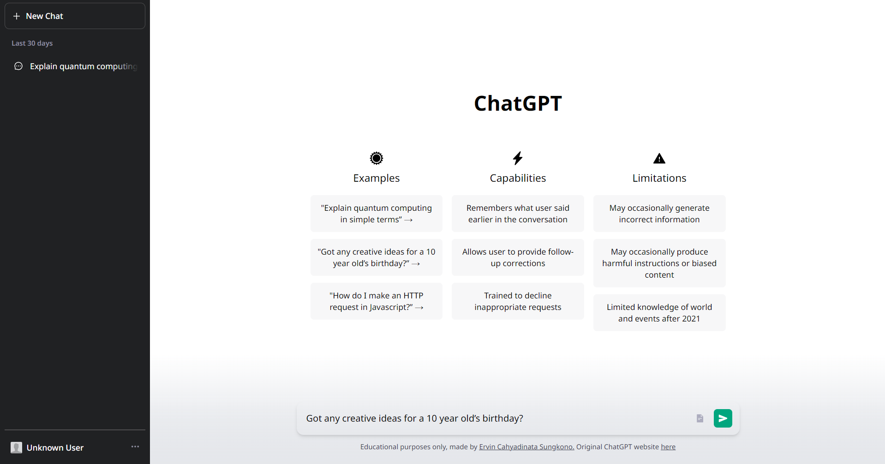
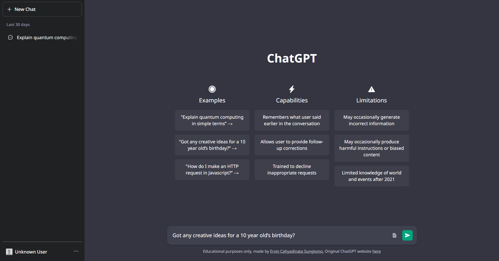

# ChatGPT Clone Website
A clone of the original ChatGPT Website, using localStorage features instead of database to store chat history.

**This project is for educational purposes only.**

## Resources
- [Next.js v13](https://nextjs.org)
- [Next Themes](https://www.npmjs.com/package/next-themes)
- [ChatGPT API](https://platform.openai.com/docs/api-reference)
- [Tailwind CSS](https://tailwindcss.com/)

## Key Features
1. Handling server sent events using ReadableStream
2. Light & Dark Theme
3. Reading .txt file input
4. Save chat history using localStorage
5. Markdown support

## Preview Image
Light Mode


Dark Mode


## Installation and Setup
1. Clone this repository
```sh
git clone https://github.com/ervin-sungkono/ChatGPT-Clone.git
```
2. Setup env variables
```sh
cp .env.example .env
```
| Variable | Description |
| :--- | :--- |
| `API_URL` | Your OpenAI API endpoint |
| `OPENAI_KEY` | Your OpenAI API key |

3. Install dependency
```sh
npm install
```
4. Run the app
```sh
npm run dev
```

This project is deployed using Vercel, [click here](https://chatgpt-clone-ervin-sungkono.vercel.app/) to see the result.